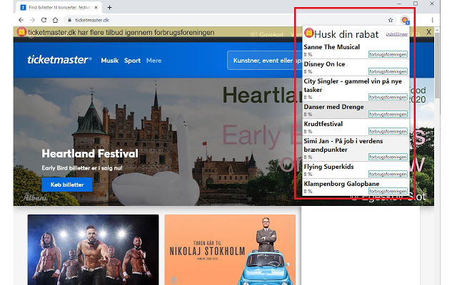
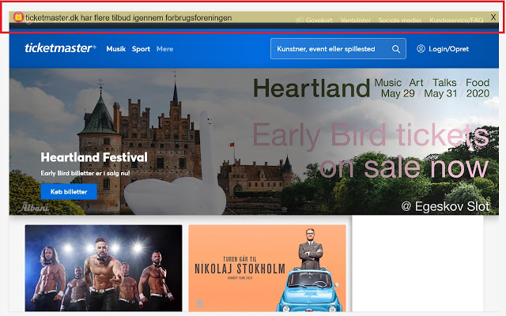

Content of data fields published to Chrome Web Store

Store link: https://chrome.google.com/webstore/detail/rabatten/ekaaoiehoehhfffifhgclflhjjkppdnc

Languages found below:
# Danish [ISO 639-1 = da]
## Titel (fra manifest)

Rabatten

## Oversigt (fra manifest)

Rabat husker, et hurtigt klik og du kan se om du kan få rabat på siden

## Beskrivelse

Rabat husker, et hurtigt klik og du kan se om du kan få rabat på siden
Start med at vælge de sider du får rabat gennem. Herefter ser du en besked i toppen af hjemmesiderne med info omkring gældende rabat på netop denne hjemmeside.

For mere info, klik på ikonet øverst i højre hjørne når en blå indikator viser at der er rabat på siden.

## Butiksikon

## Screenshots

1 

2 

## Kampagnebilleder

Lille 

## Flere felter

### Webadresse

Startside: https://github.com/zinen/Rabatten

Support: https://github.com/zinen/Rabatten/issues
